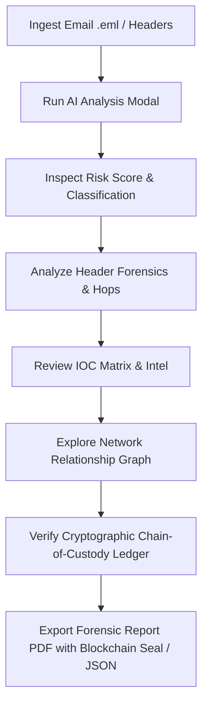

# TraceX — AI-Powered Email Threat Detection & Forensic Intelligence

[](file:///c:/temp123/TraceX/index.html)
[](#license)
[](file:///c:/temp123/TraceX/index.html)

**TraceX** is an enterprise-grade cybersecurity web application designed for Security Operations Center (SOC) analysts, email security engineers, and forensic investigators. It provides end-to-end capabilities to ingest suspicious email artifacts (`.eml`), inspect raw headers, trace relay infrastructure, analyze Indicators of Compromise (IOCs), correlate campaign clusters, seal cryptographic chain-of-custody evidence using client-side Web Crypto blockchain ledgers, and generate comprehensive forensic reports.

---

## 🛡️ Key Features

### 📩 Email Ingestion & Parsing
* **Multi-Format Ingestion**: Drag-and-drop `.eml` evidence files or paste raw email header text directly into the sandbox.
* **Pre-Loaded Incident Presets**: Test and demonstrate threat workflows using real-world scenario presets:
  * **BEC Financial Fraud**: Executive impersonation attempting a $450,000 acquisition wire transfer.
  * **Credential Harvesting**: Sophisticated Office 365 password expiry trap.
  * **Clean Corporate Communication**: Validated internal IT maintenance notification.

### 🤖 AI Threat Assessment & Risk Scoring
* **Comprehensive Risk Engine**: Generates real-time risk scores (0–100) and threat classifications (e.g., *Business Email Compromise*, *Credential Harvesting*, *Legitimate Communication*).
* **Multi-Layered Authentication Diagnostics**: Analyzes SPF (Sender Policy Framework), DKIM (DomainKeys Identified Mail), and DMARC (Domain-based Message Authentication, Reporting, and Conformance) alignment.
* **Social Engineering Detection**: Scans email body payloads for urgency indicators, financial wire requests, spoofed display names, and lookalike domains.

### 🕵️ Deep Header Forensics & Infrastructure Relay Tracing
* **Hop-by-Hop Relay Analysis**: Decodes `Received:` headers to map the complete network path from the originating sending node through intermediate relays to the edge mail gateway.
* **Relay Node Telemetry**: Evaluates IP addresses, Autonomous System Numbers (ASN), geographical locations, latency, and risk status for each hop.
* **Geographic Map Visualizer**: Visually maps email transit routes across global network infrastructure.

### 🔍 Indicators of Compromise (IOC) Matrix
* **Multi-Type IOC Extraction**: Categorizes IOCs by type (IP, Domain, URL, Email, Attachment Hash).
* **Threat Telemetry & Reputation**: Displays reputation scores, first/last seen timestamps, and correlated threat intelligence.
* **Interactive Side Drawer**: Inspect deep telemetry, associated subdomains, and related security cases.

### 🕸️ Interactive Network Investigation Graph
* **Visual Relationship Mapping**: Renders node-link visual networks connecting email cases, lookalike domains, anonymizing IP relays, malicious URLs, malware payloads, and campaign clusters (e.g., `#APEX-PHISH-2026`).
* **Node Detail Inspector**: Click any graph entity to view detailed connection relationships and risk metrics.

### 🔒 Client-Side Cryptographic Chain-of-Custody & Evidence Vault
* **Web Crypto API SHA-256 Hashing**: Automatically computes cryptographic SHA-256 signatures for evidence payloads using native `crypto.subtle.digest()`.
* **Browser-Native Micro-Ledger**: Links evidence blocks (`blockHeight`, `timestamp`, `prevHash`, `currentHash`, `payloadSnippet`, `status`) in a parent-child chain stored in `localStorage` without external server dependencies.
* **Interactive Integrity Verification & Tamper Simulation**: Includes interactive verification widgets to validate full cryptographic chain integrity or simulate payload tampering.

### 📄 Executive & Technical Forensic Reporting
* **Print-Ready PDF Export**: Formatted executive forensic reports featuring the official Blockchain Vault Seal ready for instant PDF rendering (`window.print()`).
* **JSON Incident Bundle Export**: Download full investigation case bundles (case details, active email, blockchain ledger, IOC matrix, graph data, timeline) as structured JSON files.

---

## 📁 Project Structure

```
TraceX/
├── index.html                  # Main HTML entry point & Tailwind CSS configuration
├── css/
│   └── styles.css              # Custom CSS variables, typography & layout styling
├── js/
│   ├── app.js                  # Main TraceXApp controller & router logic
│   ├── sampleData.js           # Sample incident presets, IOCs, graph & timeline datasets
│   ├── services/
│   │   └── blockchainVault.js  # Web Crypto SHA-256 micro-ledger & evidence vault service
│   └── components/
│       ├── header.js           # Top navigation bar with active tab controls
│       ├── mobileNav.js        # Mobile viewport navigation bar
│       ├── hero.js             # Platform introduction banner & high-level metric widgets
│       ├── workflow.js         # Interactive step-by-step investigation workflow card
│       ├── analyzer.js         # Email dropzone, raw header input & preset selector
│       ├── analysisModal.js    # Animated live scanning sequence modal
│       ├── threatResult.js     # Risk score dashboard & quick threat action controls
│       ├── headerForensics.js  # Header authentication pills & hop-by-hop relay timeline
│       ├── mapVisualizer.js    # Infrastructure geographic route visualizer
│       ├── iocMatrix.js        # Indicators of Compromise table & inspection drawer
│       ├── investigationGraph.js# SVG node-link investigation graph & detail panel
│       ├── timeline.js         # Chronological event timeline
│       ├── evidenceChain.js    # Blockchain micro-ledger & evidence chain verifier
│       └── forensicReport.js   # Printable forensic report view with blockchain seal & JSON bundle export
├── README.md                   # Project overview & documentation
└── TECHSTACK.md                # Technology stack & development tools specification
```

---

## 🚀 Getting Started

### Prerequisites
TraceX is built using native **ES6 JavaScript Modules**, **Web Crypto API**, and standard **HTML5/CSS3**. It operates entirely client-side in any modern web browser without requiring Node.js build tools, transpilers, or external database setups.

### Running Locally
To launch TraceX locally, serve the project root folder using any local HTTP web server (required for native JavaScript ES Module imports):

#### Option 1: Python HTTP Server
```bash
# Python 3.x
python -m http.server 8080
```
Then open `http://localhost:8080` in your web browser.

#### Option 2: Node.js `serve` / `npx`
```bash
npx serve .
```

#### Option 3: VS Code Live Server
1. Open the `TraceX` workspace folder in VS Code.
2. Right-click [`index.html`](file:///c:/temp123/TraceX/index.html) and select **Open with Live Server**.

---

## 🕹️ User Workflow



1. **Ingest**: Select a sample incident preset (e.g., *BEC Financial Fraud*) or drop an `.eml` file into the [Analyzer Component](file:///c:/temp123/TraceX/js/components/analyzer.js).
2. **Analyze**: Click **Run AI Analysis** to trigger the scanning sequence.
3. **Investigate**: Explore header authentication results, hop-by-hop relay latency, IOC reputation scores, and the interactive SVG network graph.
4. **Verify**: Navigate to the Evidence Chain view to confirm cryptographic Web Crypto SHA-256 evidence block sealing and parent hash pointers.
5. **Report**: Export a print-formatted PDF report featuring the Blockchain Seal or download the complete incident data bundle in JSON format.

---

## 📄 License

This project is open-source under the MIT License.
