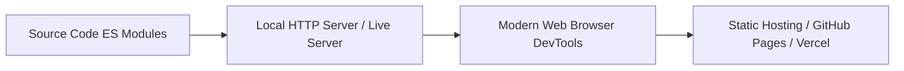

# TraceX — Tech Stack & Tools Specification

This document details the complete technology stack, design system, component architecture, data models, and development tools utilized in building **TraceX**.

---

## 🛠️ Core Technology Stack

| Category | Technology | Usage & Purpose |
| :--- | :--- | :--- |
| **Markup** | **HTML5** | Semantic, accessible layout structure (`<main>`, `<header>`, `<section>`, `<nav>`, `<aside>`) with dark mode class configuration. |
| **Logic & Scripting** | **JavaScript (ES6+)** | Modular client-side architecture using native ES Modules (`import`/`export`), class-based application state management, dynamic DOM rendering, and event delegation. |
| **Styling Framework** | **Tailwind CSS (v3 CDN)** | Utility-first styling framework loaded via CDN with `@tailwindcss/forms` and `@tailwindcss/container-queries` plugins. Custom theme extension configured in [`index.html`](file:///c:/temp123/TraceX/index.html). |
| **Custom Styling** | **Vanilla CSS3** | Custom CSS variables, scrollbar styling, glassmorphic backdrop filters, monospace data formatting, print media queries, and pulse animations in [`css/styles.css`](file:///c:/temp123/TraceX/css/styles.css). |
| **Typography** | **Google Fonts** | Primary UI Sans font: **Hanken Grotesk**; Code & Telemetry Monospace font: **JetBrains Mono**. |
| **Iconography** | **Material Symbols Outlined** | Lightweight vector icon font provided by Google Fonts for cybersecurity indicators, navigation, and action buttons. |

---

## 🎨 Visual Identity & Design System

TraceX implements the **Stitch Visual Identity** design system, tailored for high-density cybersecurity operations.

### Color Palette Tokens

```json
{
  "colors": {
    "background": "#141313",
    "surface": "#141313",
    "surface-container-low": "#1c1b1c",
    "surface-container": "#201f20",
    "surface-container-high": "#2a2a2a",
    "surface-variant": "#353435",
    "technical-accent": "#64d2ff",
    "outline-variant": "#45474a",
    "on-background": "#e5e2e1",
    "on-surface-variant": "#c5c6ca",
    "primary-fixed": "#e2e2e5",
    "error-container": "#93000a",
    "on-error-container": "#ffdad6",
    "threat-high": "#ffb4ab",
    "threat-safe": "#81c784"
  }
}
```

### Typography Hierarchy
* **Headings & Body**: `Hanken Grotesk` (`font-sans`) — Clean, modern aesthetic optimized for dashboards and telemetry tables.
* **Hashes, IPs & Telemetry**: `JetBrains Mono` (`font-mono`) — Precision monospace font for cryptographic SHA-256/MD5 hashes, IP addresses, raw email headers, and timestamps.

---

## 🧩 Component Architecture

TraceX uses a lightweight, zero-dependency component pattern. Each component is a pure JavaScript module exporting a render function that returns HTML strings based on passed state objects.

```
js/
├── app.js                          # Core Application Controller (TraceXApp)
├── sampleData.js                   # Mock Datasets (Emails, IOCs, Graph, Timeline)
└── components/
    ├── header.js                   # Navigation bar & active tab switcher
    ├── mobileNav.js                # Responsive bottom navigation bar
    ├── hero.js                     # Header banner & overview KPI widgets
    ├── workflow.js                 # 6-step interactive forensic workflow process
    ├── analyzer.js                 # Ingestion dropzone, raw text input & preset loader
    ├── analysisModal.js            # Multi-stage AI threat scan progress modal
    ├── threatResult.js             # Threat score summary, authentication pills & CTAs
    ├── headerForensics.js          # Authentication status & hop-by-hop relay timeline
    ├── mapVisualizer.js            # Infrastructure geo-location route visualizer
    ├── iocMatrix.js                # IOC telemetry table & inspection drawer
    ├── investigationGraph.js       # SVG node-link investigation network graph
    ├── timeline.js                 # Chronological investigation log timeline
    ├── evidenceChain.js            # Cryptographic evidence vault & integrity verifier
    └── forensicReport.js           # Print-ready executive forensic report view
```

### Component Map & Functionality

| Component File | Exported Function | Role & Key Features |
| :--- | :--- | :--- |
| [`header.js`](file:///c:/temp123/TraceX/js/components/header.js) | `renderHeader(activeTab)` | Top application header with tab navigation, live SOC status badge, and alert counter. |
| [`mobileNav.js`](file:///c:/temp123/TraceX/js/components/mobileNav.js) | `renderMobileNav(activeTab)` | Compact bottom navigation bar for mobile viewports. |
| [`hero.js`](file:///c:/temp123/TraceX/js/components/hero.js) | `renderHero()` | Hero section featuring key threat statistics (Risk 94/100, 4 Hops Traced, 6 IOCs, 100% Chain Custody). |
| [`workflow.js`](file:///c:/temp123/TraceX/js/components/workflow.js) | `renderWorkflow()` | Step-by-step investigation roadmap card detailing the 6 processing stages. |
| [`analyzer.js`](file:///c:/temp123/TraceX/js/components/analyzer.js) | `renderAnalyzer(sampleEmails)` | Email ingestion UI supporting `.eml` drag-and-drop, file browsing, raw header text paste, and 3 sample presets. |
| [`analysisModal.js`](file:///c:/temp123/TraceX/js/components/analysisModal.js) | `renderAnalysisModal()`, `triggerAnalysisSequence()` | Simulated 5-pass AI analysis progress overlay modal with automated step timer logic. |
| [`threatResult.js`](file:///c:/temp123/TraceX/js/components/threatResult.js) | `renderThreatResult(state)` | High-level risk score gauge, threat classification badges, AI confidence ratings, and quick actions. |
| [`headerForensics.js`](file:///c:/temp123/TraceX/js/components/headerForensics.js) | `renderHeaderForensics(activeEmail)` | Deep header inspection panel with SPF/DKIM/DMARC status pills, domain alignment, and interactive relay hop timeline. |
| [`mapVisualizer.js`](file:///c:/temp123/TraceX/js/components/mapVisualizer.js) | `renderMapVisualizer(originGeo)` | Geographic infrastructure transit map depicting originating node, relay hops, confidence score, and network disclaimers. |
| [`iocMatrix.js`](file:///c:/temp123/TraceX/js/components/iocMatrix.js) | `renderIocMatrix(iocs)` | Categorized Indicators of Compromise table with threat intelligence scores and side-drawer detail view. |
| [`investigationGraph.js`](file:///c:/temp123/TraceX/js/components/investigationGraph.js) | `renderInvestigationGraph(graphData)` | Interactive SVG network graph displaying entity relationships between case, domains, IPs, URLs, attachments, and campaign clusters. |
| [`timeline.js`](file:///c:/temp123/TraceX/js/components/timeline.js) | `renderTimeline(timelineEvents)` | Chronological investigation timeline with millisecond-accurate timestamps and action statuses. |
| [`evidenceChain.js`](file:///c:/temp123/TraceX/js/components/evidenceChain.js) | `renderEvidenceChain(currentCase)` | Evidence integrity vault displaying SHA-256 and MD5 cryptographic signatures, operator audit logs, and tamper simulation toggle. |
| [`forensicReport.js`](file:///c:/temp123/TraceX/js/components/forensicReport.js) | `renderForensicReport(currentCase, activeEmail)` | Full executive forensic report view with digital signing badge, PDF print trigger (`window.print()`), and JSON case bundle downloader. |

---

## 💻 Development, Inspection & Delivery Tools

### Client-Side Browser APIs Utilized
* **DOM API & Event Delegation**: High-performance single-listener event handling attached to the main document.
* **HTML Content & Blob Downloads**: Encodes incident bundles as JSON Data URLs for client-side file saving (`data:text/json;charset=utf-8,...`).
* **Clipboard API**: Instant one-click copy functionality (`navigator.clipboard.writeText`) for SHA-256 hashes and IOC indicators.
* **Window Print API**: Native PDF report generation formatted via `@media print` CSS rules.

### Recommended Development & Hosting Tools



1. **Web Server Tools**:
   * `Python 3.x http.server` (`python -m http.server`)
   * `Node.js serve` (`npx serve .`)
   * `VS Code Live Server Extension`
2. **Browser Developer Tools**:
   * **Console Tab**: Monitoring application state and module loading.
   * **Network Tab**: Inspecting font and Tailwind CDN resource loads.
   * **Elements / Inspector Tab**: Verifying dynamic DOM updates during tab navigation.
3. **Deployment Environments**:
   * Compatible with any static web host: GitHub Pages, Vercel, Netlify, Cloudflare Pages, AWS S3 / CloudFront, or corporate intranet Nginx/Apache servers.

---

## ⚡ Performance & Optimization Highlights

* **Zero Build Step Overhead**: No Webpack, Vite, or Babel bundling required; loads pure native JavaScript ES modules directly in browser.
* **Instant Cold Starts**: Renders in milliseconds with lightweight CSS styling and CDN font preconnections.
* **Responsive Across Viewports**: Adapts seamlessly to desktop, tablet, and mobile displays via flexbox, grid, and Tailwind media queries.
